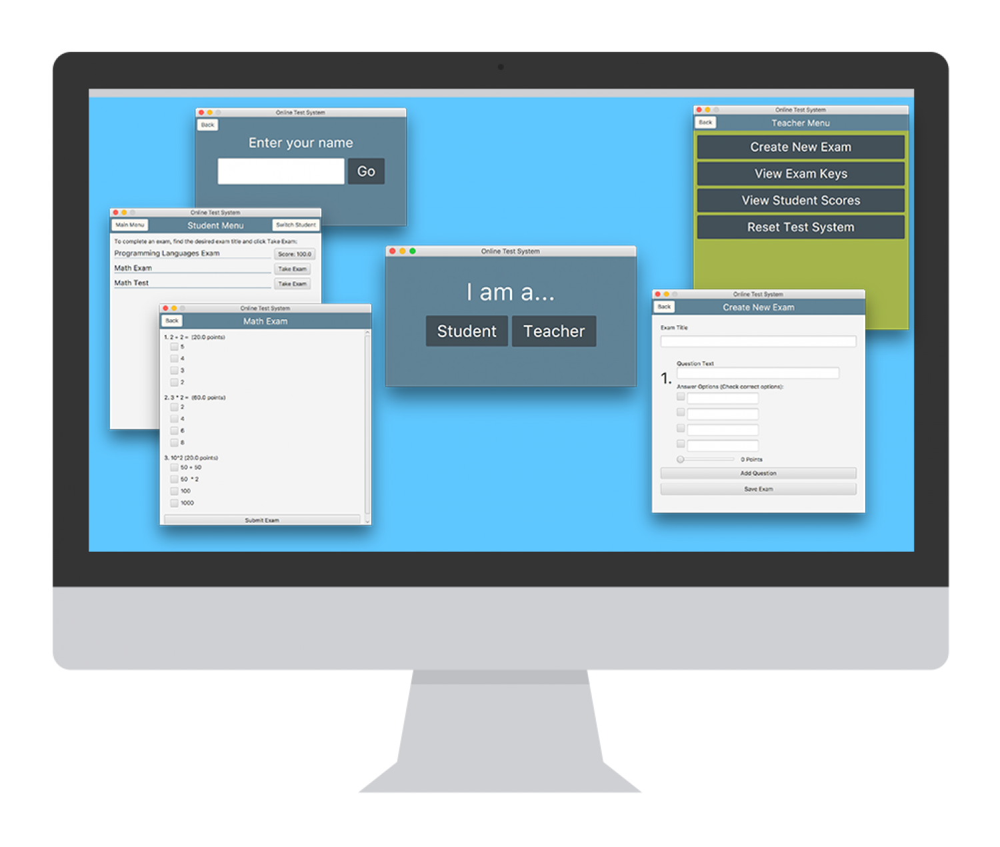

For a project in my Object Oriented Programming II class, students were asked to create a basic program using Java and JavaFX that allowed exams to be created by an instructor and taken by students. My program was awarded Best GUI (Graphical User Interface) in the class.

