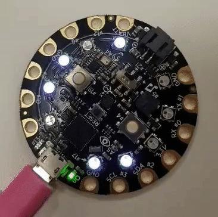

In the spring of 2017, I completed this project with a partner for CMSC216H (Introduction to Computer Systems). We developed a game in C for the Adafruit Circuit Playground microcontroller, in which a user tapped on capacitive touch pads in order to "fill in" the spinning circle of pixels to win, as the spinning got progressively faster. The goal of this project was to motivate the various related lessons about different peripherals and how the Arduino microcontroller works. 