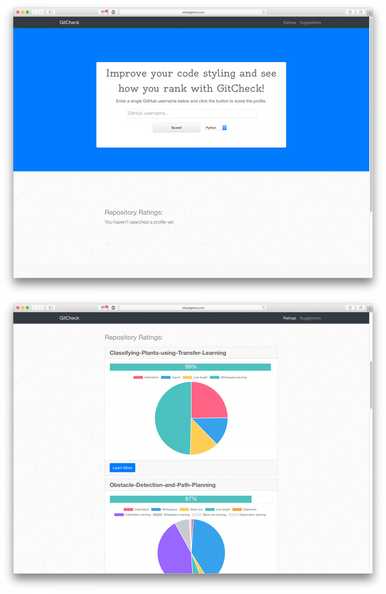

GitCheck is a web app that scores code in a GitHub user's repositories based on language style guidelines. I worked on this project at PennApps XVII (Winter 2018) with three other teammates. GitCheck made it to the top 30 round. The app is built in node.js and makes calls to code style checkers for the languages it recognizes in the user's GitHub repos. It then shows breakdowns of style violation categories for each repository, and provides the user with suggestions based on the most-often violated categories. Feel free to check out the project's [DevPost page](https://devpost.com/software/codechecker) or [GitHub repo](https://github.com/Nicole-K-R/CodeChecker).