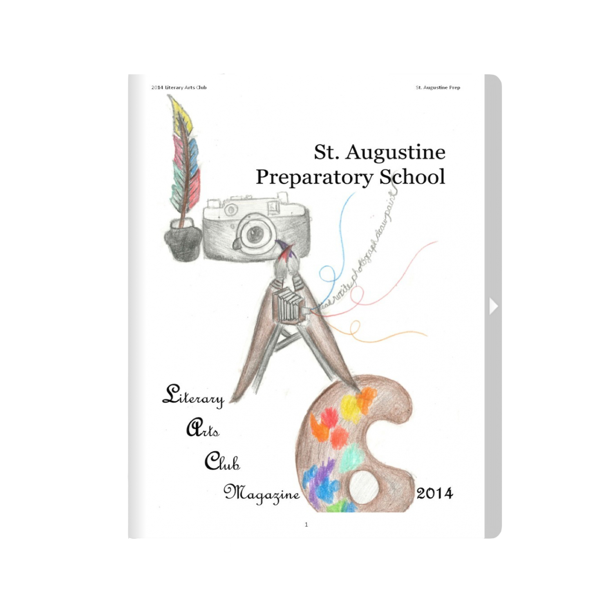
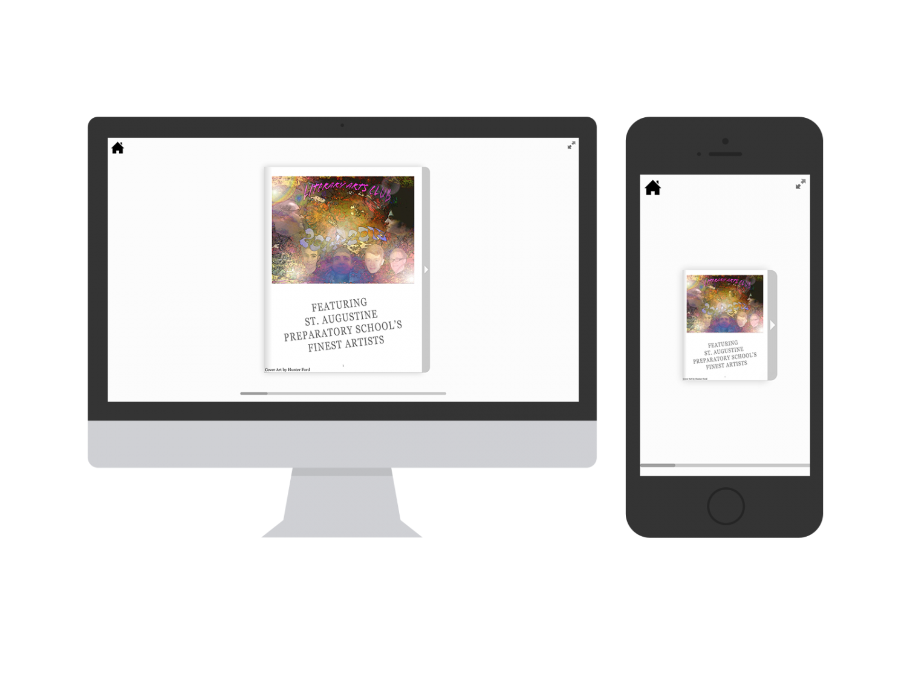

While in high school, I was a member of my school's Literary Arts Club. We produced an annual magazine of student poetry, short stories, photography, and artwork. I suggested that we transition the physical magazine to a digital one that would allow us to cut back on printing costs and bring the magazine to people anywhere, anytime.