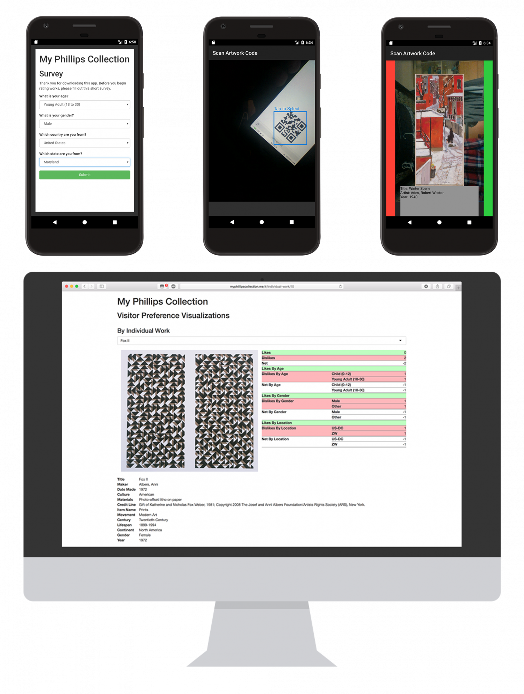

My Phillips Collection is a mobile app and corresponding web app that a partner and I developed in the spring of 2017 for a research project as part of the [UMD FIRE program](My Phillips Collection). As members of the FIRE [Phillips Virtual Culture](https://fire.umd.edu/streams-PVC.html) research stream, we worked with [The Phillips Collection](http://www.phillipscollection.org/), a museum of modern art in Washington D.C., researching how the museum experience can be improved through the use of immersive technologies such as VR, AR, and location services.

The Android app allows museum visitors to scan a QR code associated with a work of art, which displays information about the work to the user and allows them to rate the work (like or dislike). This rating information is associated with the user and their demographics - the first time the app is installed on a device, the user is asked to complete a short survey about themselves (age, location, etc.). This allows museum curators to use the web application to view statistics about which works are liked by different types of visitors.

Note: Due to the limited time we had to develop this app, we focused on adding the important features first and recognize that the UI could use some improvements.

Press: [From VR to V-Art](My Phillips Collection)

Code:
- [Android app](https://gitlab.com/kellermark/fire-phillips-app)
- [Web app](https://gitlab.com/kellermark/fire-phillips-data)
