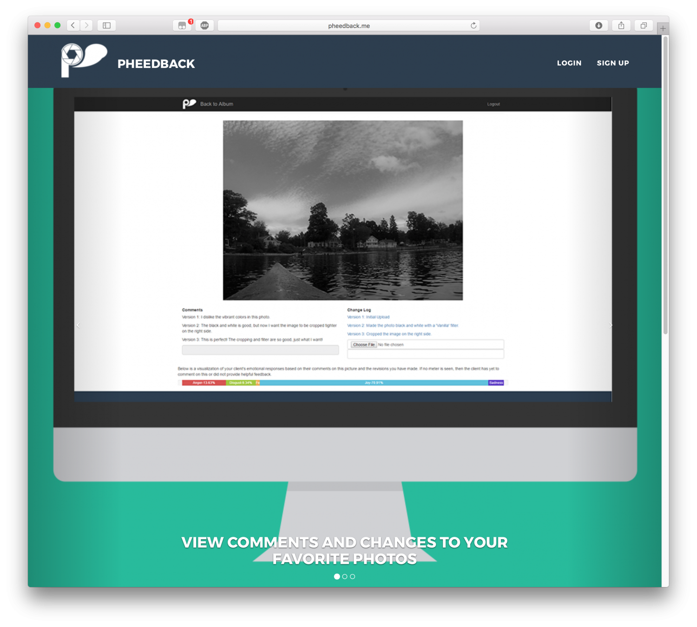

Pheedback is a web application built in collaboration with two friends for Bitcamp 2017, the University of Maryland's annual hackathon. I worked on developing the back end, connecting the app with our database and an AWS S3 instance for photo uploads.

The web app is designed to help photographers collaborate with clients during the editing process. It allows photographers to upload albums of photos and grant access to clients. The clients can leave "pheedback" on photos in the form of comments. These comments are then processed with IBM's Watson machine learning API to determine their tone, which are provided to the photographer in a graphic that displays traits such as sadness, happiness, and disgust. A versioning system allows photographers to upload edited photos so that the feedback process can be repeated.

This project won the Namecheap award for best domain name. More details can be found on the project's Devpost [here](https://devpost.com/software/pheedback).