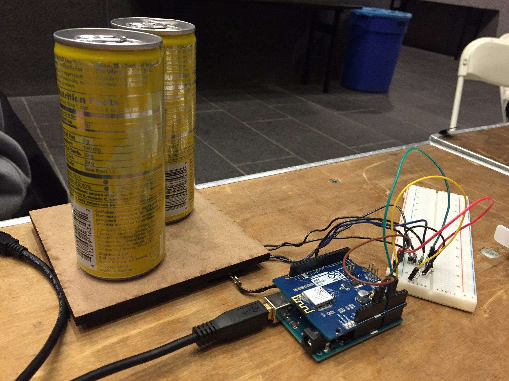

Stock Overflow is a prototype of an inventory management system that uses force sensors underneath a "shelf" to determine the number of products in stock. It was built by myself and two other team members as a submission for the PennApps winter 2017 hackathon which took place January 20-22 at the University of Pennsylvania. Stock Overflow made it to the top 30 round. To learn more about Stock Overflow, visit its DevPost page [here](https://devpost.com/software/stock-overflow-o3fl9e).