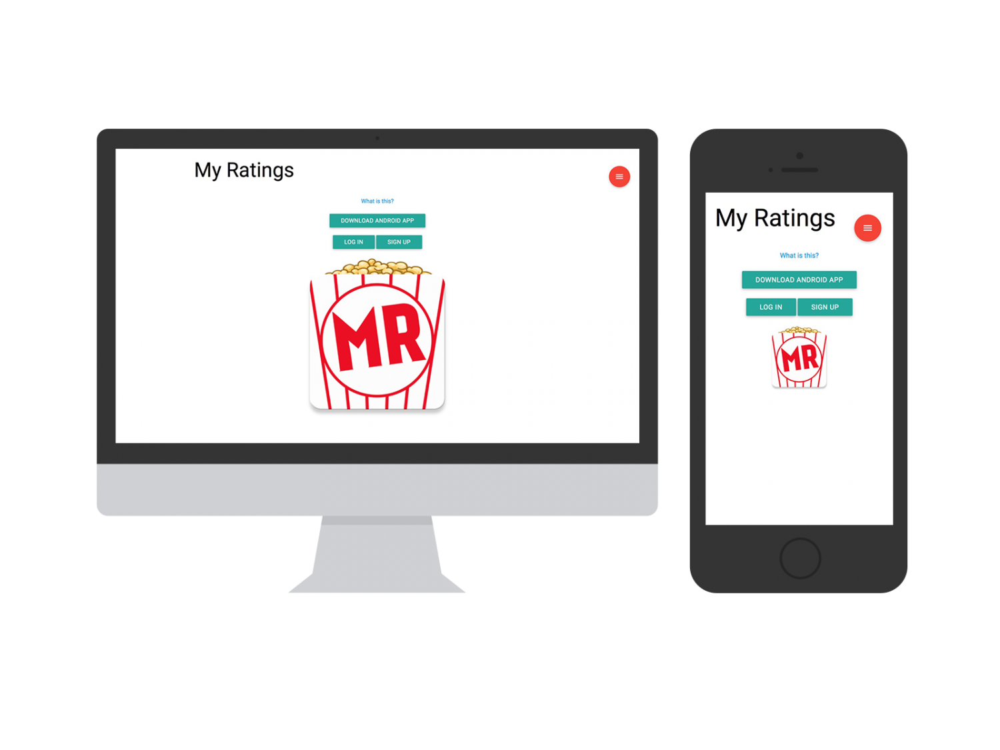

In 2015, a friend and I decided to enter the US Congressional App Challenge, so we developed an Android app called My Ratings, which can be downloaded at myratingsapp.com. The website was created along with the app as a place to manage the MySQL database that stores the user, movie, and rating data.

My Ratings is a movie rating app based on user demographics. This means that based on the "Categories" you choose, the ratings you see will be different than the ratings someone else sees. For example, users who set their age as "child" will see much different rankings than users who set their age as "adult". The philosophy behind this is that different types of people tend to appreciate different types of movies.