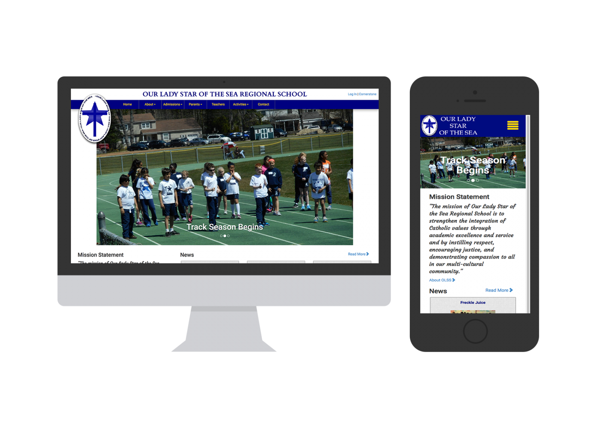

A small Catholic school in Atlantic City was in need of a website, so I created this site as a service project to help the school to more effectively communicate with families, students, and teachers. The site contains calendars, documents, a blog, pages that can easily be updated, accounts for every teacher and administrator, and numerous forms. The site can be viewed [here](http://olssac.org/).