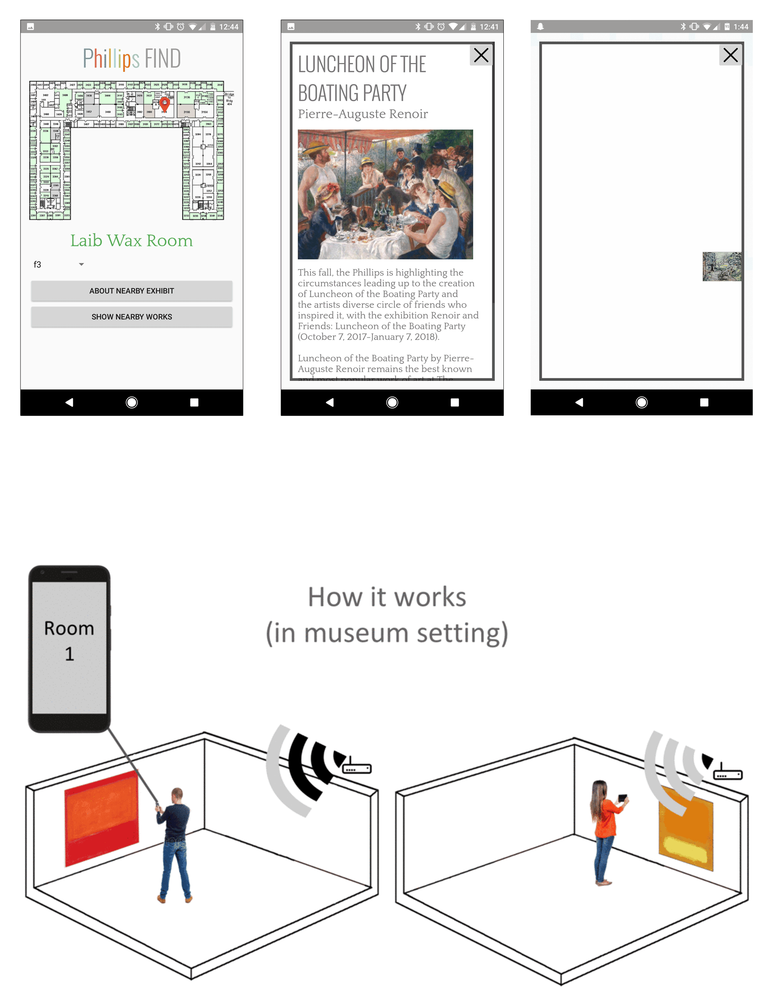

During the fall 2017 semester, I continued to work with the [UMD FIRE program](https://fire.umd.edu/), as a member of the [Phillips Virtual Culture](https://fire.umd.edu/streams-PVC.html) research stream. I researched indoor location tracking and how it can be implemented in the museum environment. I developed an Android app called Phillips FIND, that uses [RSSI](https://en.wikipedia.org/wiki/Received_signal_strength_indication) and existing wifi infrastructure to locate a user and provide information about nearby exhibits. In addition, data obtained through this app could be used by curators to analyze trends in visitor routes and paths through the museum.

Code: [https://github.com/keller-mark/find-client-android](https://github.com/keller-mark/find-client-android)