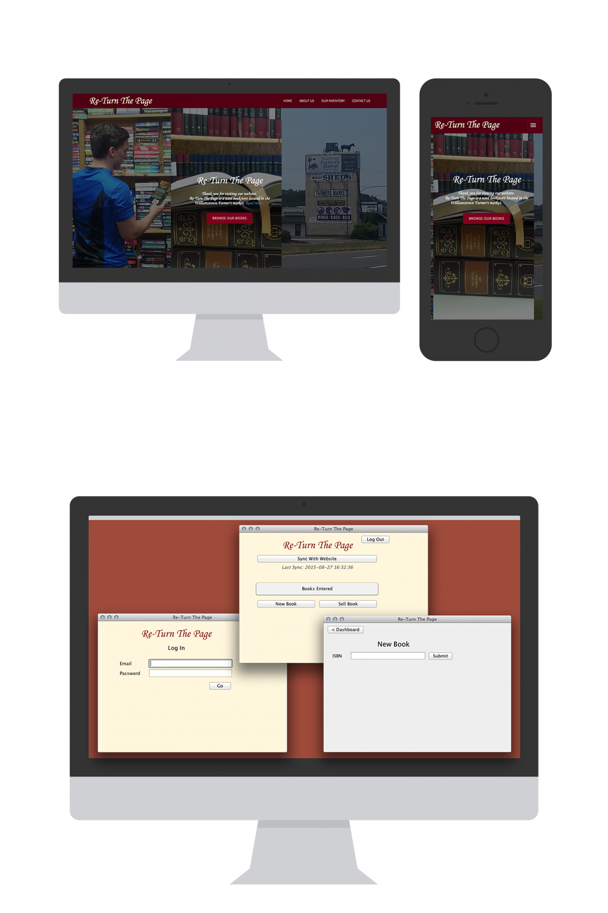

This second-hand-book store was in need of both a website and an inventory management system. I combined the two functions and stored the inventory in the website’s database, allowing customers to search for books before taking a trip to the store. I also wrote a program in Java that can record inventory using a barcode scanner while a computer is offline and sync with the website database when an internet connection is reestablished. The website can be accessed [here](http://www.re-turnthepage.com/).

The web-based inventory management system I created for this second-hand-bookstore was not always available due to an intermittent internet connection, so I created this Java desktop application to sell and add books while offline, then sync the data with the database once the computer reconnected to the internet.