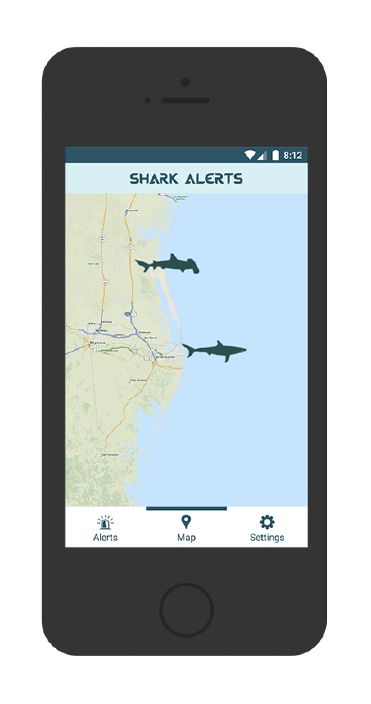

Shark Alerts is an application for Android and iOS that notifies of the tagged sharks within a radius that is defined by each user. 

In addition, Shark Alerts displays a list of all tagged sharks near your location, along with details about each one including its species, weight, length, age, and gender. The Map view displays all tagged sharks in the world and also provides a detailed list of attributes for each shark. Within the app's settings, you can change your location, sensitivity radius, and frequency that the app checks for sharks.

Unfortunately, the shark tracking information is not public data so Shark Alerts was not able to be released on the Google Play Store or Apple App Store.