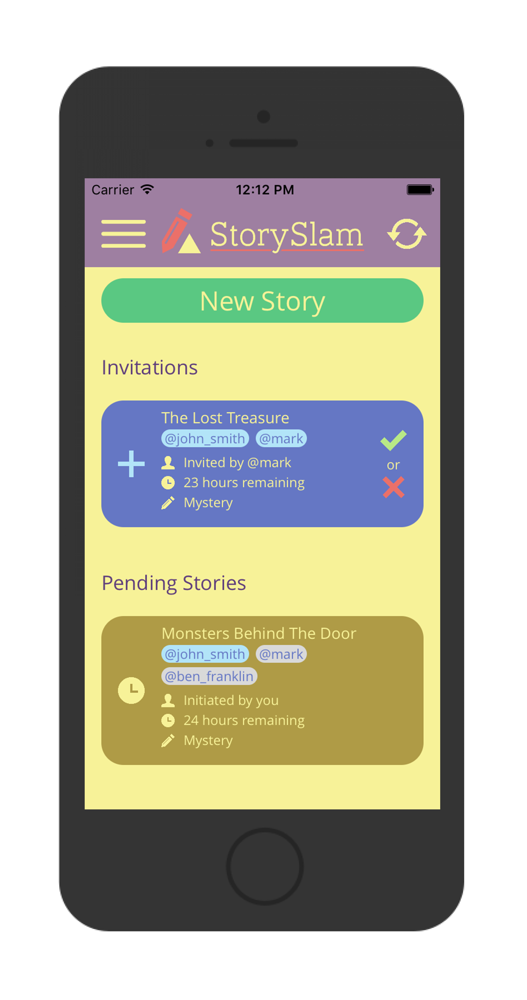

StorySlam is an iOS application that I developed for fun in January 2017 and was available on the App Store for about a year. It was developed in Swift and the code is available at [https://github.com/keller-mark/storyslam-ios-client](https://github.com/keller-mark/storyslam-ios-client). The server-side portion was a mess of PHP based largely upon the style of the code at [https://github.com/keller-mark/infercms](https://github.com/keller-mark/infercms).